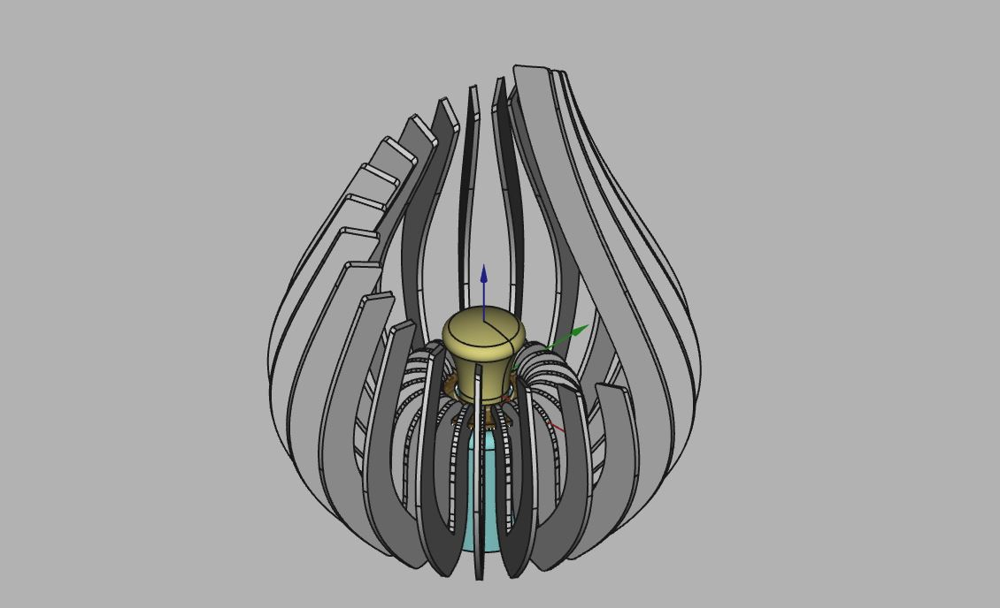

# Lamp frame for IKEA RÅSEGEL

Simple laser cut lamp frame designed for the IKEA RÅSEGEL lamp holder. Anything of similar size should also work just fine. If you have a different kind of lamp base, you can adjust the source FreeCAD files to make it work for your hardware.

The design is made around a standard E27 Philips Hue bulb, but I think just about any bulb will work. If the bulb is much bigger than a Philips one, it may *look* a bit out of place.

Files are generated for 4mm thick panels.

### FreeCAD setup

The design was generated with FreeCAD 0.20.1. To be able to generate the 2D projections of the individual ribs, you will need a way to align your view with the selected face. You can use the `Align View to Face` macro. You can grab it through FreeCAD's addon manager. With your view aligned to the face, you can generate the projection through `Draft` > `Shape2DView`.

### Generating export files

DXF files are generated with the new (i.e. not the "legacy" one) DXF export option in FreeCAD. Some DXF viewing software may not render the DXF output correctly. Best to check in your lasercutter software to check if the output from FreeCAD is interpreted correctly. If not, you can try exporting as SVG.

### Credit

The design is heavily inspired by [these products by LaserFileGuru on etsy](https://www.etsy.com/nl/listing/1618440953/svg-theelichthouder-bundel-lasergesneden?epik=dj0yJnU9UVJRUjlBZFE4QkJpOVFRa3JLeHc2YUpHY25pUEF0UnQmcD0wJm49eW0yOThkTk1laC1rdUZ3RFVCR0NBdyZ0PUFBQUFBR1pUUG1V)