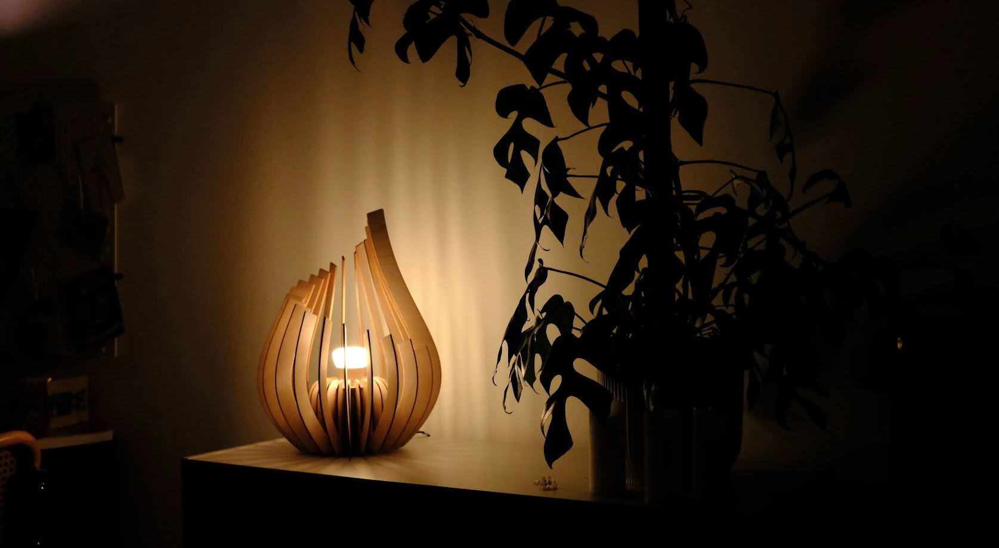
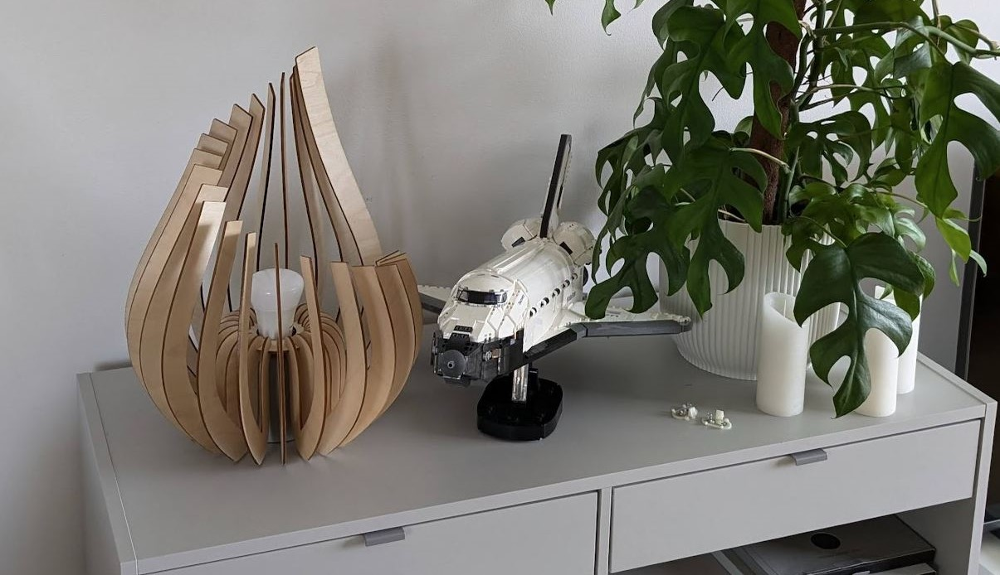

# Lamp frame for IKEA RÅSEGEL

Simple laser cut lamp frame designed for the IKEA RÅSEGEL lamp holder. Anything of similar size should also work just fine. If you have a different kind of lamp base, you can adjust the source FreeCAD files to make it work for your hardware.

The design is made around a standard E27 Philips Hue bulb, but I think just about any bulb will work. If the bulb is much bigger than a Philips one, it may *look* a bit out of place.

Files are generated for 3mm thick panels. 

### Practical Tips

As each lasercutter and material is a bit different, the stock `.dxf` files may not give the perfect tolerances. I suggest you cut the "arms" of the design with the `.dxf` files as is, and then cut the central spokewheel last, and tune the tolerances on that piece (using FreeCAD) such that you get a snug fit. The central spokewheel is easy to adjust in FreeCAD, and easy to export to dxf.

### FreeCAD setup

The design was generated with FreeCAD 0.20.1. To be able to generate the 2D projections of the individual ribs[^1], you will need a way to align your view with the selected face. You can use the `Align View to Face` macro. You can grab it through FreeCAD's addon manager. With your view aligned to the face, you can generate the projection through `Shape2DView`[^1].

I wish there was a cleaner way (i.e. one that involved less manual clicking) to generate the output `dxf` files, but short of python scripting I don't know of a way.[^2]

### Generating export files

DXF files are generated with the new (i.e. not the "legacy" one) DXF export option in FreeCAD. Some DXF viewing software may not render the DXF output correctly. Best to check in your lasercutter software to check if the output from FreeCAD is interpreted correctly. If not, you can try exporting as SVG.

Because of the nature of `dxf` projection used, each line is present twice in the `dxf` export (front and back face of each "arm"). I don't really have a way to prevent that efficiently. If it gives you trouble you can delete the duplicate lines in your vector graphics software.

### Credit

The design is heavily inspired by [these products by LaserFileGuru on etsy](https://www.etsy.com/nl/listing/1618440953/svg-theelichthouder-bundel-lasergesneden?epik=dj0yJnU9UVJRUjlBZFE4QkJpOVFRa3JLeHc2YUpHY25pUEF0UnQmcD0wJm49eW0yOThkTk1laC1rdUZ3RFVCR0NBdyZ0PUFBQUFBR1pUUG1V)

[^1]: Using the [Shape2DView of the Draft workbench](https://wiki.freecad.org/Draft_Shape2DView) in FreeCAD
[^2]: If you have suggestions, please do not hestitate to reach our or create an issue on GitHub with your idea!